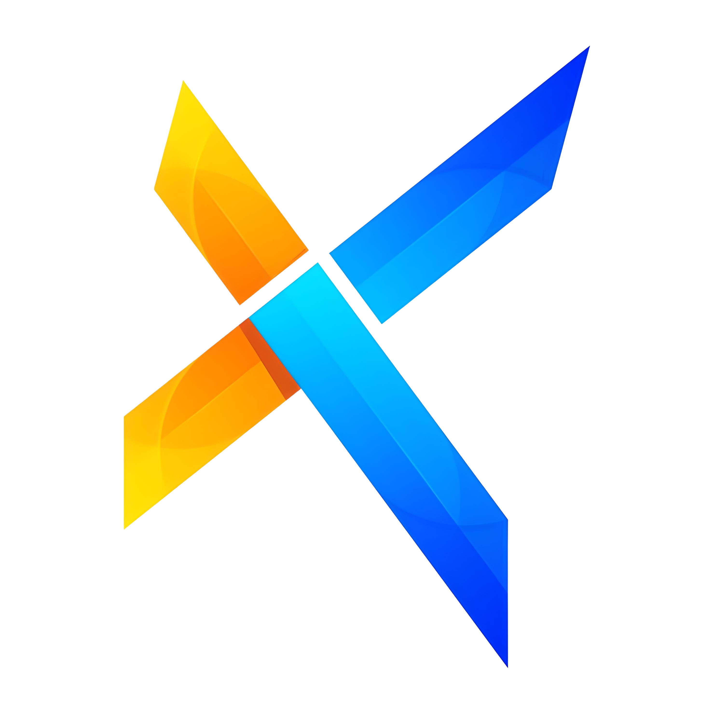

 

  
  <h3 align="center">KyDash Co</h3>

  

    Introducing our innovative data-driven application designed for seamless data analysis and predictive modeling.
     
     
    <a href="https://github.com/jadfost/flask-python"><strong>Explore the docs »</strong></a>
     
     
    <a href="https://github.com/jadfost/flask-python">View Demo</a>
    .
    <a href="https://github.com/jadfost/flask-python/issues">Report Bug</a>
    .
    <a href="https://github.com/jadfost/flask-python/issues">Request Feature</a>
  

    

## Table Of Contents

* [About the Project](#about-the-project)
* [Built With](#built-with)
* [Roadmap](#roadmap)
* [Contributing](#contributing)
* [License](#license)
* [Authors](#authors)
* [Acknowledgements](#acknowledgements)

## About The Project

Introducing our innovative data-driven application designed for seamless data analysis and predictive modeling. Built upon the Flask framework, our platform leverages cutting-edge tools and automation to empower users in unlocking valuable insights from their datasets.

## Built With

The heart of our application beats with Flask, a micro-framework in Python. Flask's minimalist approach empowers us to build scalable, modular, and user-friendly web interfaces, making it the ideal choice for our dynamic platform.

Leveraging the prowess of Pandas, NumPy, and Openpyxl, our application integrates state-of-the-art analytical tools. Pandas for data manipulation, NumPy for scientific computing, and Openpyxl for seamless Excel integration collectively enhance our data analysis capabilities.

The predictive modeling prowess of our application is driven by Scikit-Learn, a robust machine learning library. Scikit-Learn empowers users to implement predictive algorithms effortlessly, contributing to accurate and reliable model predictions.

* [Flask](https://github.com/pallets/flask/)

## Roadmap

See the [open issues](https://github.com/jadfost/flask-python/issues) for a list of proposed features (and known issues).

## License

MIT License

Copyright (c) [2024] [JadFost]

## Authors

* **JadFost** - *Lead Developer* - [JadFost](https://github.com/jadfost)
* **David Nieves** - *Machine Learning* - [DavAnalyst](https://github.com/DavAnalyst)
